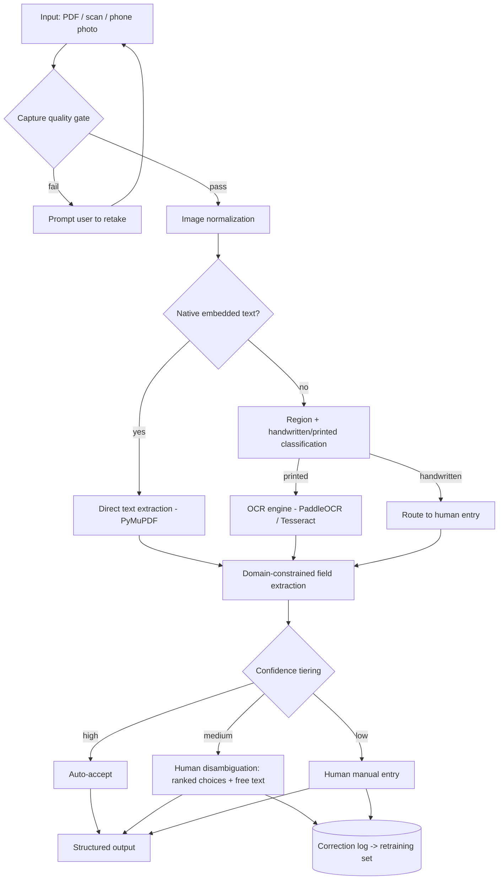

# Medical Document Parser — Architecture & Design Document

**Status:** Living design document (v1.0)
**Purpose:** A single source of context describing the goals, constraints, architecture, technology choices, and roadmap for a local, CPU-based system that extracts structured data from medical prescriptions and pathology reports.
**How to use this doc:** Treat it as the canonical reference when making implementation decisions or onboarding collaborators. It captures not just *what* was chosen but *why*, including alternatives that were considered and rejected. Update the version and changelog as decisions evolve.

---

## 1. System overview

The system ingests medical documents — **prescriptions** and **pathology/lab test reports** — that arrive as text PDFs, scanned PDFs, or phone-camera photographs, and produces **structured, machine-readable output** (drug names, dosages, instructions; test names, values, units, reference ranges, flags) for downstream processing.

It runs **entirely locally on a normal PC without a GPU**, uses **no cloud LLM APIs**, and may optionally use **small, locally-runnable models** where they earn their keep. Because the domain is safety-critical and the inputs are noisy, the design is built around a **human-in-the-loop** model: the machine extracts and proposes, a human confirms or corrects anything ambiguous, and every correction is captured to improve the system over time.

---

## 2. Goals and non-goals

### Goals
- Extract structured data from prescriptions and pathology reports with high reliability on the fields that matter.
- Accept three input forms: native-text PDF, scanned PDF, and phone-camera photo.
- Run on commodity CPU hardware, fully offline / on-premise.
- Treat human verification as a first-class part of the pipeline, not an afterthought.
- Capture human corrections as structured, trainable data from day one.

### Non-goals
- Fully autonomous, no-human extraction of safety-critical fields (explicitly rejected — see §10).
- Cloud LLM dependence or sending patient data to third-party APIs.
- Clinical decision support, drug-interaction checking, or diagnosis (out of scope; this system extracts data, it does not interpret it medically).
- Real-time / sub-second per-page throughput as a hard requirement (nice to have, not required).

---

## 3. Constraints and operating context

| Constraint | Implication |
|---|---|
| CPU-only, no GPU | Favour classic CV + classic OCR for the hot path; small models only where CPU latency (seconds/page) is acceptable. |
| Fully local / offline | All models and dictionaries ship with the deployment; no API calls. This is also a **privacy advantage** for patient data. |
| Safety-critical domain | Dosages and drug names must never be silently auto-filled from low-confidence reads. Human confirmation required for risky fields. |
| Indian context (Mumbai) | Handwritten prescriptions are common; drug formulary should be India-specific (brand + generic); multilingual content possible. |
| Noisy inputs | Phone photos and doctor handwriting are the dominant difficulty drivers, not the OCR engine itself. |

---

## 4. Document taxonomy and difficulty

The two document types have very different difficulty profiles. Treat them as **two sub-projects** that share a common front-end.

### 4.1 Pathology / lab reports — *tractable*
- Machine-generated by lab information systems; clean printed text even when received as a scan/photo.
- Content is **tabular**: test name, value, unit, reference range, abnormal flag (H/L).
- Main engineering effort: **table-structure extraction** and **field normalization** (mapping "Haemoglobin"/"Hb"/"HGB" → one canonical test; parsing `13.5 g/dL (13.0–17.0)` into value/unit/range), plus handling per-lab layout variation.
- Mostly deterministic. Classic OCR is sufficient for character recognition.

### 4.2 Prescriptions — *forked difficulty*
- **Printed / EHR-generated:** behaves like any printed document — tractable.
- **Handwritten:** genuinely hard and safety-critical. Failure drivers are irregular spacing, wildly varying handwriting styles, and non-standard abbreviations. Off-the-shelf OCR performs poorly. Published accuracy figures (e.g. claims of ~98%) are typically on curated datasets and should not be assumed for real-world scrawl.
- Decision: route handwritten prescriptions to **human entry**, assisted by dictionary-backed suggestions, rather than trusting machine output.

### Difficulty summary
| Type | Source | Difficulty |
|---|---|---|
| Pathology report | Any | Moderate (table + normalization) |
| Prescription | Printed/EHR | Moderate |
| Prescription | Handwritten | Hard — human-in-the-loop mandatory |
| Any | Phone photo | Adds a normalization front-end that affects *all* types |

---

## 5. High-level architecture

**Pipeline in words:** capture-with-quality-gate → image normalization → native-text check → region/handwriting classification → OCR (printed) or human route (handwritten) → domain-constrained field extraction → confidence-tiered human review → structured output, with all corrections logged for retraining.

---

## 6. Stage-by-stage design

> **Implementation note (suite-shared).** The **domain-agnostic** parts of the
> post-recognition pipeline — text normalization (§6.2 cleanup helpers), fuzzy
> vocabulary matching (§6.6), and confidence tiering (§6.7) — are implemented once in
> the shared **`@scandoc/core`** package (`sharedCoreLib/scandoc-lib`), reused by every
> myLife document-reading app (myHealth, myDocs). The **medical domain** parts (the drug
> formulary, LOINC vocabulary, `extractPrescription`/`extractLab`) stay in
> `myHealth/src/import/`. The boundary between capture/recognition (§6.1–6.5) and the
> text engine is the `@scandoc/core` **`Recognizer`** interface — the native-text fast
> path and the future OCR sidecar both implement it; today only the offline
> `nativeTextRecognizer` ships.

### 6.1 Capture & quality gating
- Applies when the input is a live phone capture (and as a sanity check on uploads).
- Immediately after capture, run a fast check: is a document boundary detectable? Is it in focus? Is there glare over text regions? Is resolution sufficient?
- On failure, prompt for a **retake** before any expensive processing.
- **Rationale:** catching a bad photo at capture costs one re-tap; catching it after OCR produces garbage costs a confused human reviewer downstream. This is the single best accuracy investment in a phone-first workflow. Glare/blown-out text is unrecoverable by any later algorithm, so it *must* be caught here.

### 6.2 Image normalization
Turns a messy photo into something resembling a clean scan. Runs in order:

1. **Boundary detection + perspective correction (workhorse).** Grayscale → blur → Canny edges → find largest 4-corner contour → perspective transform (homography) to a clean rectangle. Fixes "flat page shot at an angle," the most common phone-photo defect. Fast, deterministic, GPU-free. (OpenCV.)
2. **Deskew.** Detect residual tilt via Hough transform / projection profile, rotate to align text baselines.
3. **Dewarping (conditional).** Only needed when paper is *curved/folded* (perspective correction assumes flatness). ML models predict a dense unwarping grid or displacement flow, trained on synthetically warped docs. **Do not build this in from the start** — gate it behind a "is this page warped?" check and add only if real-world curl proves to hurt OCR. Most single-sheet medical docs are flat.
4. **Lighting normalization + binarization.** Use **adaptive thresholding** (adaptive Gaussian / Sauvola), not a global threshold, so shadowed regions survive. Glare is a capture problem, not an algorithm problem (see 6.1).

**Tooling guidance:**
- Classic OpenCV path covers ~90% of flat-sheet phone captures. Start here.
- ML dewarping options if needed: displacement-flow FCN (noted as easy to implement, moderate compute) or stacked-U-Net grid predictors (RectiNet family); lightweight classic `page_dewarp` "cubic sheet" as a cheap fallback.
- Alternatively, some newer VLM-OCR models tolerate mild skew/lighting directly (trained on camera images), so "more preprocessing" vs "more robust recognizer" is an explicit, revisitable trade-off.

### 6.3 Native-text fast path
- Open every PDF with **PyMuPDF (`fitz`)**. Per page, check for usable embedded text.
- If present → take it directly. Free, instant, perfect accuracy, no model. Many lab reports and EHR prescriptions are native-text PDFs.
- Only fall through to OCR for scanned pages, photos, or embedded raster regions flagged as containing text. Use **pdfplumber** when positional/table data from native PDFs is needed.

### 6.4 Region & handwriting classification
- Detect text regions vs image regions (avoid double-processing).
- Classify regions as **printed vs handwritten**. Printed → OCR engine. Handwritten → human entry route (assisted, see 6.7).
- This classification step is more important once phone photos are in scope, because quality varies per region.

### 6.5 OCR (printed content)
- **Default engines (CPU-friendly, deterministic):** PaddleOCR (better layout/accuracy) or Tesseract (easiest to deploy, most battle-tested). Classic detect→recognize pipelines remain the right tool for CPU-only, air-gapped, high-throughput printed scans.
- **Optional small VLM-OCR fallback** for hard pages (dense tables, degraded scans): models such as GLM-OCR (~0.9B) or MinerU2.5 (~1.2B) output clean Markdown with reading order and tables reconstructed.
  - **Caution:** these can *hallucinate* — inventing plausible-but-wrong words on ambiguous input (documented failure: wrong-language word substitution on tiny scanned text). On a dosage, a confident hallucination is a patient-safety event. Use only with confidence surfacing; never let one silently fill a value. Expect seconds-to-tens-of-seconds per page on CPU.

### 6.6 Domain-constrained field extraction
The highest-leverage accuracy mechanism. Do **not** trust raw recognized characters; constrain them against known vocabularies.

- **Prescriptions:** fuzzy-match recognized drug strings against an **India-specific drug/brand formulary**; match dosage forms and frequencies against a controlled list (OD/BD/TDS/QID, mg/ml/units). A bad character read often snaps to the correct real medicine.
- **Pathology:** normalize test names against a standard vocabulary (e.g. **LOINC**) plus a per-lab synonym map; parse `value unit (low–high)` patterns; capture H/L/abnormal flags.
- **Structured output schema** is produced here (see 6.9).

### 6.7 Confidence tiering & human-in-the-loop review
Route by confidence tier, not a single threshold, so human attention lands only where needed:

- **High confidence →** auto-accept.
- **Medium confidence →** **disambiguation UI**: present top-N *real* candidates (sourced from the formulary/test vocabulary, ranked by combined OCR + fuzzy-match score) **plus a free-text "Other"** escape hatch.
- **Low confidence / handwritten →** **manual entry**, dictionary-assisted.

Design notes:
- The free-text "Other" entry should itself **re-validate against the formulary**, so a human typo doesn't reintroduce the error.
- Safety-critical fields (drug name, dosage) are **confirm-required** regardless of tier when derived from non-native-text sources.
- Tiering avoids review fatigue (forcing confirmation of everything leads to rubber-stamping).

### 6.8 Correction logging & retraining loop
- Every human action — candidate chosen, photo retaken, "Other" typed — is logged in a **structured, trainable form**, tied to the lab/doctor/source conditions.
- This becomes a labeled dataset reflecting *your* real handwriting, formats, and phone-photo conditions.
- Use it to fine-tune later — handwriting recognition in particular improves dramatically when trained on the actual data seen in production rather than generic datasets.
- **The human-in-the-loop is therefore both the safety net and the data-collection engine.** Build the logging from day one.

### 6.9 Structured output
- Emit a stable schema (JSON recommended) per document, e.g.:
  - **Prescription:** patient (optional), prescriber (optional), list of `{drug, strength, form, frequency, duration, instructions, confidence, source, verified_by}`.
  - **Pathology:** lab, panel, list of `{test_canonical, raw_name, value, unit, ref_low, ref_high, flag, confidence, source}`.
- Each field carries provenance (`source`: native-text / OCR / human) and confidence, so downstream consumers can apply their own trust policies.

---

## 7. Technology choices (summary)

| Concern | Primary choice | Alternatives / notes |
|---|---|---|
| PDF native-text extraction | PyMuPDF (`fitz`) | pdfplumber for positional/table data |
| Image normalization | OpenCV (boundary, perspective, deskew, adaptive threshold) | ML dewarping only if curl is a real problem |
| ML dewarping (conditional) | Displacement-flow FCN | RectiNet (stacked U-Net), `page_dewarp` (classic) |
| OCR (printed, hot path) | PaddleOCR | Tesseract (easiest deploy), EasyOCR |
| OCR (hard-page fallback) | GLM-OCR / MinerU2.5 (small VLM) | Use with confidence gating; CPU-slow; hallucination risk |
| Drug normalization | India-specific formulary + fuzzy match | — |
| Test normalization | LOINC + per-lab synonym map | — |
| Output | JSON with provenance + confidence | — |

---

## 8. Data, privacy & safety

- **Local-only processing is a compliance asset:** controlling the data pipeline and never sending documents to third-party APIs has clear advantages for patient-data protection and regulated/air-gapped environments.
- **No medical interpretation:** the system extracts data; it does not advise, diagnose, or check interactions.
- **Safety-critical fields gated:** drug names and dosages require human confirmation when not from native text.
- **Audit trail:** provenance + `verified_by` on every field supports traceability.

---

## 9. Phased roadmap

**Phase 1 — The tractable 80% (build first, make genuinely robust):**
- PyMuPDF native-text path.
- OpenCV image normalization (perspective + deskew + adaptive threshold) + capture quality gate.
- PaddleOCR/Tesseract for printed content.
- Pathology table extraction + LOINC normalization.
- Printed-prescription extraction + formulary matching.
- Confidence-tiered human review UI with ranked choices + free text.
- Correction logging.

**Phase 2 — Handwriting (separate, expectation-managed):**
- Handwritten-prescription route: dictionary-assisted human entry as baseline.
- Evaluate small VLM-OCR as assist (never authority) for handwriting.

**Phase 3 — Improvement loop:**
- Use logged corrections to fine-tune recognition for your specific handwriting/labs.
- Add ML dewarping only if curl is shown to hurt accuracy.

---

## 10. Key risks & mitigations

| Risk | Mitigation |
|---|---|
| Model hallucinates a wrong dosage/drug | Confirm-required gating; never auto-fill safety-critical fields; surface confidence. |
| Glare/blur destroys text | Capture-time quality gate with retake prompt. |
| Handwriting accuracy never reaches "automatic" | Designed for human entry; treat machine output as assist only. |
| Review fatigue → rubber-stamping | Confidence tiering so humans only see what needs attention. |
| Per-lab layout drift | Per-lab template/synonym library; normalization layer. |
| CPU latency from VLM-OCR | Keep it off the hot path; classic OCR default; VLM only for flagged hard pages. |

---

## 11. Open questions / decisions to make

- What is the real-world **share of handwritten vs printed** prescriptions? (Determines whether Phase 2 is a minor add-on or a major effort.)
- Which **drug formulary** source for India (and licensing)?
- Is a **capture UI** under our control (enables quality gating), or are we always handed finished files?
- Target **throughput** and acceptable per-page latency?
- Required **output schema** for the downstream consumer?

---

## 12. Glossary

- **Native-text PDF:** PDF carrying selectable character data (vs a page that is just an image).
- **Dewarping:** correcting curvature distortion in a photographed page (beyond flat perspective).
- **Deskew:** correcting rotational tilt.
- **Adaptive thresholding:** binarization computed per local region (handles shadows/uneven light).
- **VLM-OCR:** small vision-language model that reads documents end-to-end, often emitting Markdown.
- **LOINC:** standard vocabulary for identifying lab tests/observations.
- **Confidence tiering:** routing fields to auto-accept / disambiguation / manual entry by recognition confidence.

---

## Changelog
- **v1.0** — Initial architecture: scope (prescriptions + pathology), inputs (PDF/scan/photo), CPU-only/local constraints, full pipeline, human-in-the-loop design, phased roadmap.
